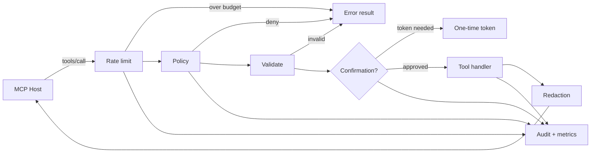

# mcp-policy-guard

[](https://github.com/mughalhere/mcp-policy-guard/actions/workflows/ci.yml)
[](https://www.npmjs.com/package/mcp-policy-guard)
[](./LICENSE)
[](https://nodejs.org)

Policy and safety middleware for [MCP](https://modelcontextprotocol.io) servers.

An MCP server hands a model a set of tools and, by default, trusts every call it
makes. `mcp-policy-guard` sits between the two: it decides which calls are
allowed, which need a human, how often they may happen, and what the response is
permitted to contain — without you touching your tool implementations.

```ts
import { guard, allow, deny, requireConfirmation } from "mcp-policy-guard";

guard(server, {
  policies: [allow("search_*"), requireConfirmation("delete_*"), deny("admin_*")],
  rateLimit: { windowMs: 60_000, maxCalls: 30 },
  audit: { sink: "file", filePath: "./audit.jsonl" },
  redact: { patterns: "strict" },
});
```

- **Zero-config default deny** — a tool with no matching `allow` rule does not run
- **No changes to your tools** — one call wraps the whole `tools/call` path
- **One dependency** (`pino`), ESM + CJS, TypeScript types included

**[Try it in your browser →](https://mughalhere.github.io/mcp-policy-guard/)** — the
demo runs this library compiled for the page, so the verdicts, tokens, and
redaction you see are the real thing.

> **Prompt injection is out of scope.** This library governs tool *execution*, not
> model prompt integrity. Pair it with input-side gating such as
> [`prompt-protection`](https://www.npmjs.com/package/prompt-protection).

---

## Contents

- [Install](#install)
- [Quickstart](#quickstart)
- [Features](#features)
- [Policies](#policies)
- [Confirmation gates](#confirmation-gates)
- [Rate limiting](#rate-limiting)
- [Identity](#identity)
- [Redaction](#redaction)
- [Audit and metrics](#audit-and-metrics)
- [Timeouts and validation](#timeouts-and-validation)
- [Tool list filtering](#tool-list-filtering)
- [Architecture](#architecture)
- [Threat model](#threat-model)
- [Upgrading from 0.1](#upgrading-from-01)
- [Documentation](#documentation)
- [Contributing](#contributing)

---

## Install

```bash
npm install mcp-policy-guard
```

`@modelcontextprotocol/sdk` is a peer dependency — install it too if you are
building a server with it:

```bash
npm install @modelcontextprotocol/sdk
```

Requires Node.js 22 or newer.

## Quickstart

### Wrap a server

Register your tools first, then guard the server. The wrapper covers every tool
routed through `tools/call`, including tools registered later.

```ts
import { McpServer } from "@modelcontextprotocol/sdk/server/mcp.js";
import { StdioServerTransport } from "@modelcontextprotocol/sdk/server/stdio.js";
import { guard, allow, deny, requireConfirmation } from "mcp-policy-guard";
import { z } from "zod";

const server = new McpServer({ name: "crm", version: "1.0.0" });

server.registerTool("list_contacts", { description: "List contacts" }, listContacts);
server.registerTool(
  "delete_contact",
  { description: "Delete a contact", inputSchema: { id: z.string() } },
  deleteContact,
);

guard(server, {
  policies: [allow("list_*"), requireConfirmation("delete_*"), deny("admin_*")],
  // stdout carries the JSON-RPC stream — never send audit there on a stdio server.
  audit: { sink: "file", filePath: "./audit.jsonl" },
});

await server.connect(new StdioServerTransport());
```

### Wrap a handler

For tests, custom transports, or servers that don't expose their handler map:

```ts
import { createGuardedHandler, allow } from "mcp-policy-guard";

const guarded = createGuardedHandler(myToolsCallHandler, {
  policies: [allow("search_*")],
});
```

Both entry points take the same options.

## Features

| Capability | Option | Notes |
| --- | --- | --- |
| Per-tool authorization | `policies` | Glob patterns, `deny` → `requireConfirmation` → `allow` |
| Argument-aware rules | `when` on a rule | Decide from the actual arguments, not just the name |
| Identity scoping | `identify`, `identities` | Per-caller policies, limits, and token binding |
| Human confirmation | `requireConfirmation` | Single-use tokens, or an out-of-band approver |
| Rate limiting | `rateLimit` | Global, per-tool, per-identity, per-pattern overrides |
| PII redaction | `redact` | 11 builtin patterns, key-based rules, Luhn-checked cards |
| Audit trail | `audit` | JSONL to stdout/stderr/file/callback, or several at once |
| Metrics | `onDecision` + `GuardMetrics` | Counters by outcome and tool |
| Timeouts | `timeoutMs` | Bound a hung tool |
| Argument validation | `validate` | Reject bad input before the tool sees it |
| Tool hiding | `filterToolList` | Denied tools disappear from `tools/list` |

## Policies

Rules are evaluated in a fixed order that does not depend on how you wrote them:

```
deny → requireConfirmation → allow → default (deny unless defaultAllow)
```

A `deny` anywhere beats every `allow`, so ordering mistakes fail closed.

```ts
import { allow, deny, requireConfirmation } from "mcp-policy-guard";

policies: [
  allow("search_*", "list_*"),        // several patterns per rule
  requireConfirmation("delete_*"),
  deny("admin_*"),
]
```

### Glob syntax

| Pattern | Matches |
| --- | --- |
| `search_*` | `search_files`, `search_` — any suffix |
| `tool_?` | `tool_a`, not `tool_ab` |
| `{get,list}_users` | `get_users`, `list_users` |
| `*` | everything |
| `!admin_*` | vetoes: `["*", "!admin_*"]` matches everything except admin tools |

### Argument conditions

`when` turns a name-level rule into a call-level one:

```ts
import { allow, deny, argStartsWith, argEquals, not } from "mcp-policy-guard";

policies: [
  allow("read_file", { when: argStartsWith("path", "/workspace/") }),
  deny("run_sql", {
    when: not(argStartsWith("query", "SELECT")),
    reason: "only SELECT statements are permitted",
  }),
  allow("run_sql"),
  requireConfirmation("deploy", { when: argEquals("env", "prod") }),
  allow("deploy"),
]
```

Builtin conditions: `argEquals`, `argMatches`, `argStartsWith`, `argGlob`,
`argPresent`, `argInRange`, `identityIs`, `metaEquals`, composed with `and`,
`or`, `not`. Any `(ctx) => boolean` works too. Keys accept dotted paths
(`argEquals("target.env", "prod")`).

A condition that throws is treated as *not matching* — never as permission.

### Policy from config

```ts
import { policiesFromConfig } from "mcp-policy-guard";

const policies = policiesFromConfig(JSON.parse(await readFile("policy.json", "utf8")));
// { "allow": ["search_*"], "confirm": ["delete_*"], "deny": ["admin_*"] }
```

Unknown keys throw at load time, so a typo cannot silently widen access.

## Confirmation gates

By default a gated tool answers with a single-use token instead of running:

1. First call returns `confirmation_required` plus a `confirmationToken`.
2. The client retries the identical call with `arguments.confirmationToken` set.
3. The token is single-use, bound to tool name + argument hash + issuing
   identity, and expires (5 minutes by default).

Argument hashing is order-independent, so a client that re-serialises arguments
differently on the retry still succeeds.

```ts
confirmation: {
  ttlMs: 60_000,          // shorter window
  tokenKey: "approvalId", // rename the argument
  bindIdentity: true,     // default: another caller cannot redeem the token
  store: myRedisStore,    // ConfirmationStore is an interface
}
```

### Out-of-band approval

If a human (or an approval service) sits outside the model loop, skip the token
round-trip entirely:

```ts
confirmation: {
  approve: async ({ tool, args, identity }) => askOncall(tool, args, identity),
}
```

Returning `false` — or throwing — denies the call.

## Rate limiting

Token buckets, all checked before any is consumed, so a call rejected by a narrow
bucket does not burn global budget.

```ts
rateLimit: {
  windowMs: 60_000,
  maxCalls: 60,
  perTool: true,        // default
  perIdentity: true,    // needs identify()
  overrides: [
    { patterns: ["generate_report"], maxCalls: 2 },
    { patterns: ["send_*"], maxCalls: 5, windowMs: 3_600_000 },
  ],
  maxBuckets: 10_000,   // LRU cap; identity cycling cannot grow memory
}
```

Rejections carry `retryAfterMs` and the `scope` that rejected
(`global`, `tool`, `identity`, `override`).

## Identity

`identify()` resolves who is calling from the request or transport context. It
feeds policies, rate limits, audit entries, and confirmation-token binding.

```ts
identify: (request, extra) => extra?.sessionId,

policies: [
  allow("admin_*", { identities: ["ops-*"] }),
  allow("search_*"),
]
```

A throwing `identify()` is logged and the caller is treated as anonymous — which,
under default deny, means identity-scoped rules stop matching.

## Redaction

Applied to tool **results** by default, optionally to arguments and audit records.

```ts
redact: {
  patterns: "strict",            // all builtins; or a list; default: email/phone/creditCard
  custom: [/EMP-\d{6}/g],
  keys: [...DEFAULT_SENSITIVE_KEYS, "internal_*"],
  replacement: "[REDACTED]",
  preserveLast: 4,               // keep a card's last four
  results: true,                 // default
  arguments: false,              // also scrub what reaches the tool
  auditArgs: true,               // scrub args recorded by the audit sink
}
```

Builtin patterns: `email`, `phone`, `creditCard`, `ssn`, `ipv4`, `jwt`,
`awsAccessKeyId`, `apiKey`, `bearerToken`, `privateKey`, `iban`.

Credit-card matches are Luhn-checked first, so order numbers and long ids stay
readable. Circular structures, `Date`s, and class instances are handled without
mangling or hanging.

## Audit and metrics

Every decision produces one JSONL entry:

```json
{"ts":"2026-07-27T18:59:24.100Z","callId":"ngm-1","tool":"delete_contact","decision":"requireConfirmation","latencyMs":1,"outcome":"confirmation_required","identity":"ops-jane","argsHash":"45fb02…"}
```

Arguments are hashed, not recorded, unless you opt in with `includeArgs`.

```ts
audit: {
  sink: [(entry) => log.info(entry), "file"],  // fan out
  filePath: "./audit.jsonl",
  includeArgs: false,
  outcomes: ["denied", "error"],               // only record what you care about
  await: true,                                 // false to keep writes off the hot path
}
```

A sink that throws is logged and swallowed: observability can never turn a
permitted call into a failed one.

For counters, feed `onDecision` into `GuardMetrics`:

```ts
import { GuardMetrics } from "mcp-policy-guard";

const metrics = new GuardMetrics();
guard(server, { onDecision: (event) => metrics.record(event) });

metrics.snapshot();
// { calls, allowed, denied, rateLimited, confirmationsRequired, errors, byTool, avgLatencyMs }
```

`callId` correlates the audit entry with the decision event for the same call.

## Timeouts and validation

```ts
timeoutMs: 15_000,

validate: (ctx) =>
  ctx.tool === "search" && typeof ctx.args.q !== "string"
    ? "search requires a string `q`"
    : true,
```

`validate` runs after policy and before confirmation, so bad arguments never mint
a token. Returning a string rejects the call with `invalid_arguments`.

A timed-out call returns a `timeout` error result. JavaScript cannot abort an
already-running promise — the underlying work may continue; the timeout bounds
what the *host* waits for.

## Tool list filtering

`guard(server)` also wraps `tools/list` so tools the policy would refuse never
appear to the model. Disable with `filterToolList: false`.

Rules carrying a `when` condition stay listed — their verdict depends on
arguments that don't exist yet — and are blocked at call time instead. Hiding is
ergonomics, not a security boundary: every call is checked regardless.

## Architecture



The ordering is deliberate: rate limiting runs first so a spamming agent is cheap
to reject, and audit records every branch — including the ones that never reach a
tool.

## Threat model

**Protects against**

- Over-broad tool exposure — default deny, plus argument-level conditions
- Accidental or unconfirmed destructive writes — confirmation gates
- Runaway agent loops — layered rate limits
- PII leaking through tool results, arguments, or audit logs
- Missing decision trail — every branch is audited
- Token replay, cross-tool reuse, and cross-identity theft
- Unbounded memory from cycled identities or token floods

**Does not protect against**

- Prompt injection or jailbreaks in the model context
- A compromised MCP host process
- Confused-deputy problems in your own business API's authorization
- Argument content in side channels — arguments are hashed in audit by default;
  enable `includeArgs` only in locked-down environments
- Timing side channels inside your own tool handlers

Long form: [docs/threat-model.md](./docs/threat-model.md).

## Upgrading from 0.1

0.2 is backward compatible: every 0.1 option and export still works. Two
behaviours changed — argument hashes are now order-independent (old audit hashes
won't match new ones), and `tools/list` is filtered by default.

Full notes: [docs/migration-v0.2.md](./docs/migration-v0.2.md).

## Documentation

- [API reference](./docs/api.md)
- [Writing policies](./docs/policies.md)
- [Recipes](./docs/recipes.md) — filesystem servers, SQL gateways, Redis-backed confirmation, Slack approvals
- [Threat model](./docs/threat-model.md)
- [Migration guide](./docs/migration-v0.2.md)
- [Changelog](./CHANGELOG.md)

Runnable examples live in [`examples/`](./examples):

```bash
npm run build
node examples/basic-wrap.mjs
node examples/crm-confirmation.mjs
node examples/advanced-policies.mjs
node examples/observability.mjs
# examples/mcp-server.mjs is a real stdio server — point an MCP host at it
```

## Contributing

Bug reports, feature requests, and pull requests are welcome. Start with
[CONTRIBUTING.md](./CONTRIBUTING.md) — it covers local setup, the test layout,
commit conventions, and what a good issue looks like.

- 🐛 [Report a bug](https://github.com/mughalhere/mcp-policy-guard/issues/new?template=bug_report.yml)
- 💡 [Request a feature](https://github.com/mughalhere/mcp-policy-guard/issues/new?template=feature_request.yml)
- 🔒 Security issues: **do not** open a public issue — see [SECURITY.md](./SECURITY.md)

## License

MIT © Muhammad Zia

Maintainers: release process in [PUBLISH.md](./PUBLISH.md).
