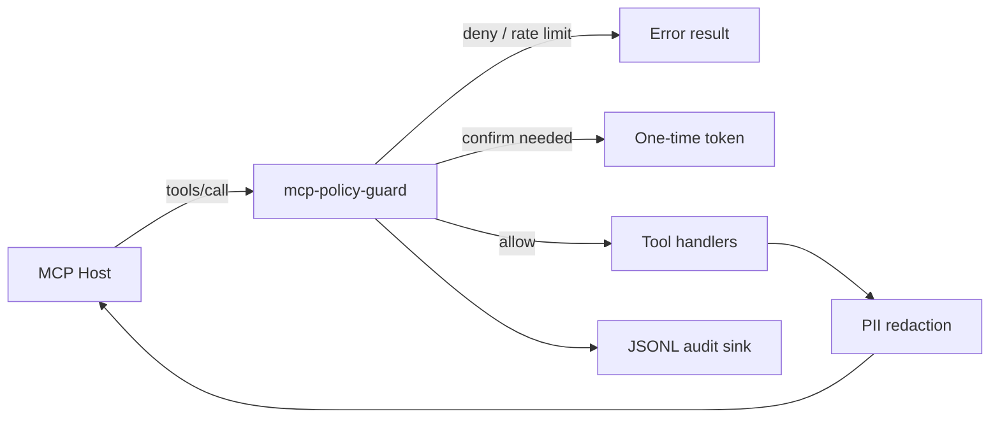

# mcp-policy-guard

Policy & safety middleware for [MCP](https://modelcontextprotocol.io) servers.

Wrap an existing tools/call handler in a few lines to get:

- Per-tool authorization policies (`allow` / `deny` / `requireConfirmation`)
- Token-bucket rate limiting (global + per-tool)
- Two-phase write confirmation (single-use tokens, 5-minute TTL)
- JSONL audit logging (args hashed by default)
- PII redaction on tool **results** (email, phone, credit card)

> **Prompt injection is out of scope.** mcp-policy-guard protects tool *execution* policy, not model prompt integrity. Pair with something like [`prompt-protection`](https://www.npmjs.com/package/prompt-protection) for input gating.

## Quickstart

```bash
npm install mcp-policy-guard @modelcontextprotocol/sdk
```

```ts
import { createGuardedHandler, allow, deny, requireConfirmation } from "mcp-policy-guard";

const handler = createGuardedHandler(yourToolsCallHandler, {
  policies: [
    allow("search_*", "list_*"),
    requireConfirmation("delete_*", "update_*"),
    deny("admin_*"),
  ],
  rateLimit: { windowMs: 60_000, maxCalls: 30, perTool: true },
  audit: { sink: "stdout" },
  redact: { patterns: ["email", "phone", "creditCard"] },
});
```

Or wrap a server after registering tools:

```ts
import { guard, allow, requireConfirmation, deny } from "mcp-policy-guard";

guard(mcpServer, {
  policies: [allow("search_*"), requireConfirmation("delete_*"), deny("admin_*")],
});
```

## Architecture



## Confirmation flow

1. First call to a `requireConfirmation` tool returns `confirmation_required` + token.
2. Retry with the same args plus `confirmationToken`.
3. Token is single-use, bound to tool name + args hash, expires in 5 minutes.
4. Store is in-memory by default (`ConfirmationStore` is pluggable for Redis later).

## Threat model

**Protects against**

- Over-broad tool exposure (default deny)
- Accidental / unconfirmed destructive writes
- Hot-loop / runaway agent tool spam (rate limits)
- Accidental PII leakage in tool *results*
- Missing audit trail for tool decisions

**Does not protect against**

- Prompt injection / jailbreaks in the model context
- Compromised MCP host process
- Confused-deputy issues in your underlying business API auth
- Side channels via tool *argument* content (hash args in audit by default; set `audit.includeArgs` only in locked-down debug)

## Scripts

```bash
npm install
npm test
npm run build
node examples/basic-wrap.mjs
node examples/crm-confirmation.mjs
```

## License

MIT © Muhammad Zia

## Publishing

Maintainers: see [PUBLISH.md](./PUBLISH.md) for first-time GitHub push and npm release via version tags.
